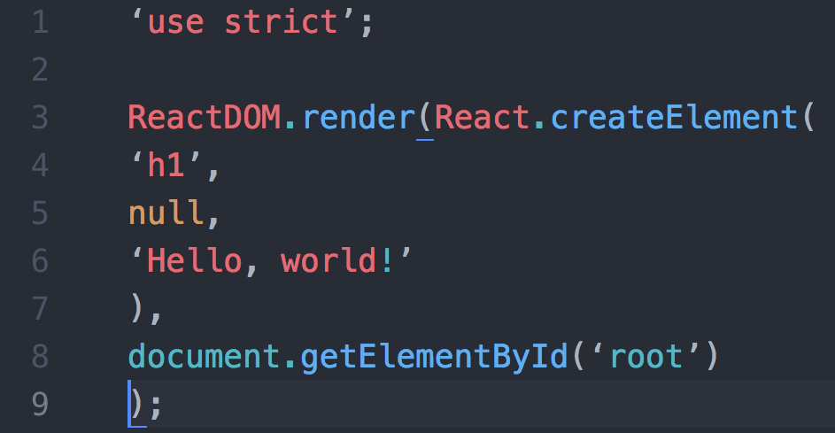

# ლექცია 1.
1. npm ის მიმოხილვა
2. რეაქთის პროექტის ინსტალაცია
3. რა არის რეაქთი და კომპონენტიზაციის ძირითადი პრინციპები
4. რა არის jsx


# Node JS ის ისნტალაციის ლინკი
https://nodejs.org/en/download/

მაგალითი, ნოუდის ვერსიის გაგების
```bash
  node --version
```

# ლექცია 1.1 ნპმ ის მომიხილვა
npm შეგვიძლია განვიხილოთ როგორც სასარგებლო მოდულების საცავი ჯავასკრიპტის პროგრამული ენისთვის, მოდულები შექმნილია და მათი
ხარისხის მუდმივი მონიტორინგი ხდება უამრავი დეველოიპერის მიერ.

მაგალითი, npm ვერსიის გაგების
```bash
  npm --version
```

მაგალითად, დავააყენოთ uuid მოდული
```bash
  npm install uuid --save
```

# ლექცია 1.1 რეაქთის პროექტის ინსტალაცია.
```bash
  npx install create-react-app .
```

# რა არის რეაქთი
ინტერფეისის ბიბლიოთეკა რომელცი საშვალებას გვაძლევს კომპლექსური ინტერფეისები დავყოთ მცირე მართავ კომპონენტებად, რომელთაც გამოვიყენებთ
სხვადასხვა ადგილზე.


# რა არის jsx
jsx სინტაქსური გაფართოვებაა ჯავასკრიპტის რომელიც საშშვალებას გვაძლევს html ის ნაწილი ვწეროთ პირდაპირ ჯავასკრიპტში და არა html ფაილში, ხოლო რეაქთი უზრუნველყოფს მის გამოტანას დომში.


## როგორ ვწერთ კოდს


## როგორ ხდება მისი კომპილაცია რეაქთის მიერ



# ლექცია 2.

# props
საშველბას იძლევა ინფორმაცია გადაწოდებულ იქნეს ერთი კომპონენტიდან მეორეზე. prop შესაძლებელია იყოს ნებისმიერი ჯავასკრიპტის მნიშვნელობა,
ვალიუ, ფუნქცია, ობიექტი ა.შ


შესაძლო ფროფები.
1. სტრინგ
2. მასივი
3. ობიექტი
5. ფუნქცია
6. ინტიჯერი

რა უნდა ვიცოდეთ prop ების შესახებ.
1. ინფორმაცია რომელსაც prop ით ვაწვდდით არამუტირებადია. read only
2. prop ები მხოლოდ ერთი მიმართულებით შეიძლება გადაეწოდოს
3. prop ჩვეულებრივი ჯავასკრიპტის ობიექტია.
4. prop შეიძლება იყოს ნებისმიერი დატატიპი.

```js

  const Component = ({ name }) => {
    return (
      <div>
        {name}
      </div>
    )
  }

  const Component2 = () => {
    return (
      <div>
        <Component title="component title" />
      </div>
    )
  }


```

# ლექცია 3. სთეით მენეჯმენტი და ივენთები
კომპონენტის მდგომარეობა რისი ცვილებაც იწევს მის ხელახალ რენდერს დომში. როგორც წესი state ს ცვლის სხვადასხვა ივენთები
